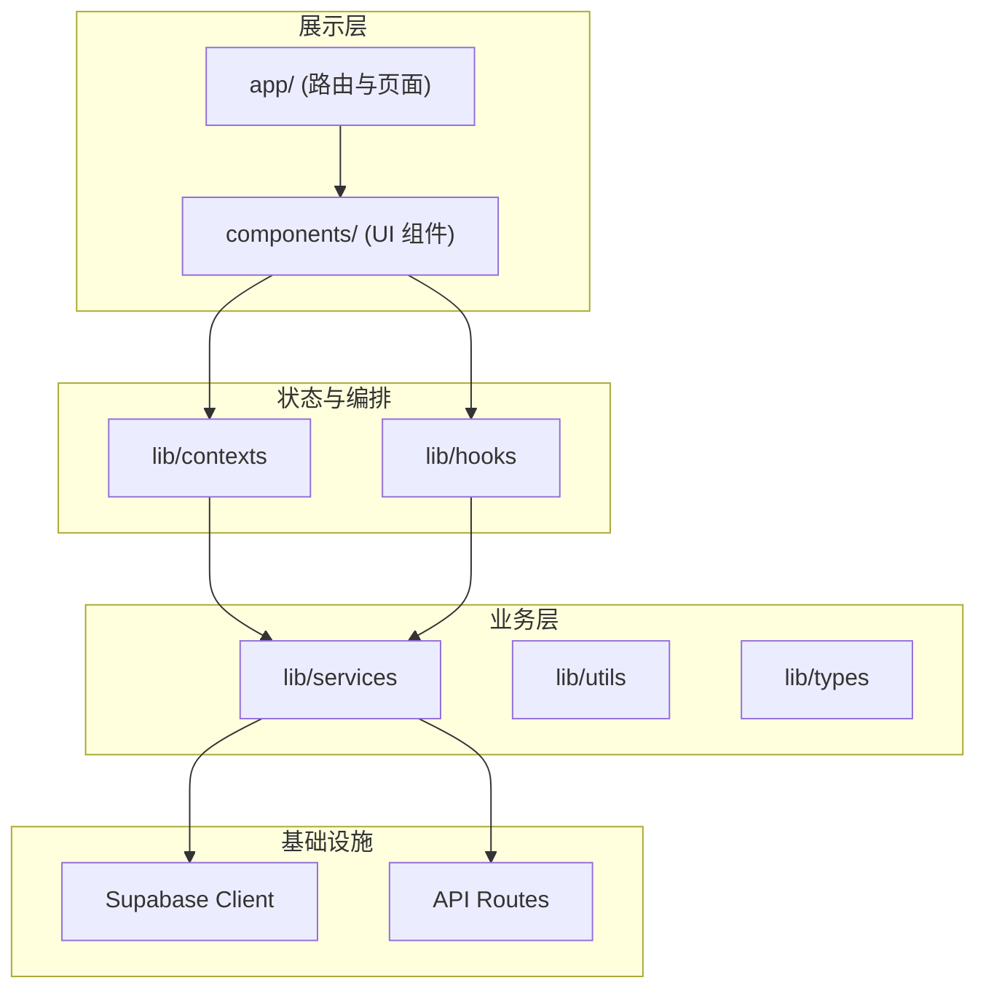

# Keco Studio 架构文档与架构图指南

本文档说明：架构文档应细化到什么程度、建议画哪些架构图、每张图的目的与画法。

---

## 一、架构文档应细化到什么程度

### 1.1 按受众与用途分层

| 层级 | 受众 | 细化程度 | 内容 |
|------|------|----------|------|
| **概览** | 新人、产品、外部协作方 | 粗粒度 | 系统边界、核心模块、主要数据流、技术栈；1–2 页能看完 |
| **设计层** | 前端/全栈开发、Code Review | 中粒度 | 分层、目录职责、Context/Service 边界、路由与权限；支撑日常开发与重构决策 |
| **实现层** | 维护者、重构执行者 | 细粒度 | 关键文件的职责、依赖关系、状态流、与「重构清单」对应；按需查阅，不必全部写死 |

**建议**：  
- 先有「概览 + 设计层」文档和图示，保证 onboarding 和日常设计讨论够用。  
- 实现层只对**易混淆、易出错、或即将重构**的部分写细（例如 Sidebar 拆分后的模块图、路由解析单一来源的流程图）。

### 1.2 细化原则

- **单一事实来源**：路由解析、类型定义、权限规则等只在一处文档化，代码与文档同步更新。  
- **与代码同步**：大重构（如 Sidebar 拆分、路由收拢）完成后，同步更新架构图与「各层职责」表。  
- **避免过度**：不追求「每个文件都上图」，只画对理解整体、做决策、或排查问题有帮助的图。

### 1.3 本项目建议的文档粒度

- **已有**：`ARCHITECTURE_ASSESSMENT_CN.md`（评估、问题、优化顺序）→ 保持，作为「设计层」的补充。  
- **建议新增**：  
  - **概览**：一页「系统概览图 + 技术栈 + 核心数据流」说明。  
  - **设计层**：分层图、路由与权限图、Context/数据流图（见下文「建议画的图」）。  
  - **实现层**：仅对 Sidebar 拆分后、路由收拢后、以及 lib 层目录结构做「模块/文件级」小图或表格，便于重构时对照。

---

## 二、建议画哪些架构图

### 2.1 图清单总览

| 序号 | 图名 | 类型 | 目的 | 建议粒度 |
|------|------|------|------|----------|
| 1 | 系统概览图 | 框图 | 系统边界、用户入口、核心后端/服务 | 应用级，不画到具体文件 |
| 2 | 前端分层与目录图 | 分层图 | 展示 app / components / lib 的职责与依赖方向 | 到「目录/包」级，不画到单文件 |
| 3 | 路由与权限图 | 路由+权限 | 路由树、受保护路由、谁用 currentIds | 到「路由段」级，可标出提供 currentIds 的单一来源 |
| 4 | Context 与数据流图 | 数据流图 | Auth / Navigation / Presence / LibraryData 等从哪里来、谁消费 | 到 Context 与主要消费者，不画每个组件 |
| 5 | 库表/协作数据流图 | 数据流图 | 库表数据、Yjs/Realtime、乐观更新、缓存失效 | 到「模块/服务」级，便于理解协作与缓存 |
| 6 | Sidebar 模块图（重构后） | 组件/模块图 | Sidebar 拆成 hooks + 子组件后的边界与数据流 | 到「hooks / 子组件」级，可选 |

---

## 三、各图的目的与画法建议

### 3.1 系统概览图

- **目的**：让人 30 秒内知道「系统是什么、用户从哪进、主要依赖谁」。  
- **建议内容**：  
  - 用户 → 浏览器 → Next.js 应用（可标出 SSR/CSR 或「主要是 SPA 型」）。  
  - Next.js App → Supabase（Auth、DB、Realtime）、可选：Resend/邮件服务。  
  - 标注技术栈：Next.js (App Router)、React、Supabase、Yjs（若对外说明）。  
- **粒度**：应用/服务级，不画到前端目录或具体 API。  
- **工具**：Draw.io、Mermaid、Excalidraw 均可；若用 Mermaid，可放在 docs 或 README 中版本化管理。

**示例结构（文字描述，便于你画图）**：  
```
[用户] → [浏览器] → [Keco Studio (Next.js)] → [Supabase (Auth + Postgres + Realtime)]
                ↓
         [Resend / 邮件]（邀请等）
```

---

### 3.2 前端分层与目录图

- **目的**：说明「代码分几层、谁可以依赖谁、主要目录各管什么」。  
- **建议内容**：  
  - 自上而下：**展示层**（`app/` 路由与页面、`components/`）→ **状态/编排层**（`lib/contexts`、部分 `lib/hooks`）→ **业务层**（`lib/services`、`lib/hooks`、`lib/utils`、`lib/types`）→ **基础设施**（Supabase Client、API Route Handlers）。  
  - 依赖方向：只允许「上层依赖下层」，不允许 services 依赖 components。  
  - 标注：`lib/` 为业务与状态核心；`components/layout` 中的 Sidebar 标注为「待拆分、职责过重」。  
- **粒度**：到「目录/包」级（如 `app/`、`components/`、`lib/services`），不列具体文件。  
- **画法**：分层框图（Layered Diagram），用 Mermaid 或 Draw.io 均可。

**示例（Mermaid 风格，可放到文档）**：  


---

### 3.3 路由与权限图

- **目的**：说清「有哪些路由、哪些需要登录/项目权限、currentProjectId/currentLibraryId 等从哪来、谁在用」。  
- **建议内容**：  
  - 路由树：`/` → `auth`、`projects`、`[projectId]`（下设 `[libraryId]`、`folder/[folderId]`、`collaborators`）等，与 `app/` 结构一致。  
  - 标注：受保护路由（需登录）、项目级/库级权限校验（NavigationContext + authorizationService）。  
  - **单一来源**：标明「currentIds 由 NavigationContext（或 useRouteParams）统一提供」，Sidebar、DashboardLayout、TopBar 只消费不重复解析。  
- **粒度**：到「路由段」级，可附一表列出「currentIds 的消费者」。  
- **画法**：树状图（路由树）+ 一小块「数据流」说明谁提供、谁使用 currentIds。

---

### 3.4 Context 与数据流图

- **目的**：说明「全局状态从哪来、谁提供、谁消费」，避免误用或重复状态。  
- **建议内容**：  
  - 列出：AuthContext、NavigationContext、PresenceContext、LibraryDataContext、SupabaseContext（及 YjsContext 若仍保留在 src 下）。  
  - 对每个 Context 标出：**数据来源**（如 Supabase、路由 params）、**主要消费者**（如 Sidebar、TopBar、库页、资产页）。  
  - 标注：NavigationContext 同时承担「路由解析 + 面包屑 + 权限校验入口」，重构后路由解析可收拢到此处或 useRouteParams。  
- **粒度**：到 Context 与「主要页面/布局组件」级，不画到每个小组件。  
- **画法**：数据流图（矩形为 Context/Provider，箭头为数据流或依赖）。

**示例（文字描述）**：  
- AuthContext ← Supabase Auth；消费者：DashboardLayout、Sidebar、TopBar、NavigationContext。  
- NavigationContext ← useParams + usePathname + Auth；消费者：面包屑、库页、资产页、权限校验。  
- LibraryDataContext ← lib 层数据 + Yjs/Realtime；消费者：库表、协作相关 UI。

---

### 3.5 库表/协作数据流图

- **目的**：理解「库表数据如何加载、如何与 Realtime/Yjs 协同、乐观更新与缓存失效如何发生」。  
- **建议内容**：  
  - 数据源：Supabase（library_assets 等）、Realtime 订阅、Yjs 文档（若用）。  
  - 中间层：LibraryDataContext、useRequestCache、useCacheMutations、useRealtimeSubscription、useYjsRows。  
  - UI：LibraryAssetsTable、版本侧栏等。  
  - 标出：queryKeys 统一管理、invalidate 时机、乐观更新边界。  
- **粒度**：到「模块/服务/hook」级，不画到每个组件内部。  
- **画法**：数据流图，从左到右或从上到下：API/Realtime → services/hooks → Context → UI。

---

### 3.6 Sidebar 模块图（重构后可选）

- **目的**：Sidebar 拆成 hooks + 子组件后，明确「谁负责树、谁负责弹窗、谁负责右键菜单」，便于维护和单测。  
- **建议内容**：  
  - 框：useSidebarRoute、useSidebarProjects、useSidebarTree、useSidebarModals、useSidebarContextMenu、SidebarTreeView、SidebarUserMenu、各 Modal。  
  - 箭头：数据与回调的流向（例如 useSidebarTree 产出 treeData → SidebarTreeView）。  
- **粒度**：到「hooks / 子组件」级。  
- **画法**：组件/模块图，在 Sidebar 重构完成并稳定后再补，避免频繁改图。

---

## 四、架构图应画到什么程度（小结）

- **必画**：  
  - **系统概览图**：应用级，用于对外/新人。  
  - **前端分层与目录图**：目录级，用于依赖约定与重构。  
  - **路由与权限图**：路由段级 + currentIds 单一来源说明，用于避免重复解析。  
  - **Context 与数据流图**：Context 级，用于理解全局状态。  
- **强烈建议**：**库表/协作数据流图**（到模块/hook 级），便于协作与缓存相关改动。  
- **按需画**：**Sidebar 模块图**（重构后再细化），便于后续维护。

细化程度：**先保证「概览 + 设计层」一致且可维护，实现层只对关键、易混、或刚重构过的部分做细**。所有图建议配上简短文字说明（受众、何时更新），并随大重构同步更新。
