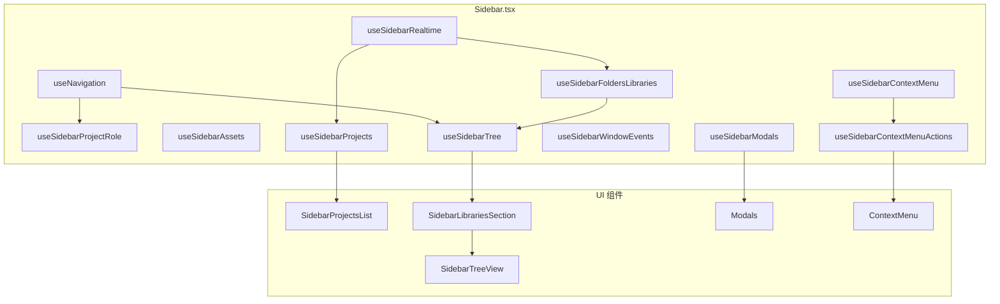
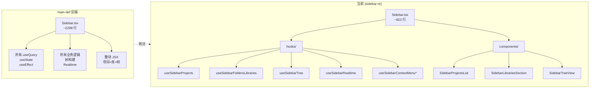

# Sidebar 架构说明

本文档描述 `src/components/layout` 下 Sidebar 的当前架构，以及与旧版的对比。

---

## 一、当前版本架构图（sidebar-re / 重构后）

```
┌─────────────────────────────────────────────────────────────────────────────────┐
│                              Sidebar.tsx (容器，~822 行)                          │
│  Props: userProfile, onAuthRequest                                                │
├─────────────────────────────────────────────────────────────────────────────────┤
│  Context: useNavigation, useSupabase, useQueryClient, useRouter, pathname         │
├─────────────────────────────────────────────────────────────────────────────────┤
│  Hooks (数据与状态)                                                                │
│  ├── useSidebarProjectRole(currentIds.projectId)     → userRole, isProjectOwner   │
│  ├── useSidebarAssets(currentIds.libraryId)         → assets, fetchAssets        │
│  ├── useSidebarModals()                              → 各类 modal 开关与 open/close│
│  ├── useSidebarContextMenu()                         → contextMenu, open/close     │
│  ├── useSidebarProjects(userProfile?.id)            → projects, loading, refetch │
│  ├── useSidebarFoldersLibraries(currentIds.projectId)→ folders, libraries, loading│
│  ├── useSidebarWindowEvents(...)                     → 快捷键切换侧栏可见性        │
│  ├── useSidebarRealtime({ supabase, queryClient, ...})→ 项目/库/文件夹/协作者实时   │
│  ├── useSidebarTree(currentIds, folders, libraries, context) → treeData, selectedKeys│
│  └── useSidebarContextMenuActions({ contextMenu, ...}) → handleContextMenuAction  │
├─────────────────────────────────────────────────────────────────────────────────┤
│  本地 state: showAddMenu, addButtonRef, selectedFolderId, error,                  │
│              expandedKeys, isSidebarVisible                                        │
├─────────────────────────────────────────────────────────────────────────────────┤
│  事件/业务: handleProjectClick, handleLibraryClick, onSelect, onExpand,           │
│             handleContextMenu, handleProjectDelete, handle*Created, ...            │
└─────────────────────────────────────────────────────────────────────────────────┘
         │
         │ 渲染
         ▼
┌─────────────────────────────────────────────────────────────────────────────────┐
│  UI 结构                                                                          │
│  ├── header (Logo + 品牌)                                                         │
│  ├── searchContainer                                                              │
│  ├── content                                                                      │
│  │   ├── SidebarProjectsList (项目列表，无 asset 时显示)                           │
│  │   └── SidebarLibrariesSection (库区：树 or 资产列表)                             │
│  │         └── SidebarTreeView (Ant Design Tree)                                  │
│  ├── NewProjectModal / EditProjectModal / NewLibraryModal / ...                   │
│  ├── AddLibraryMenu                                                               │
│  └── ContextMenu (右键菜单)                                                        │
└─────────────────────────────────────────────────────────────────────────────────┘
```

### 当前版本文件结构

```
src/components/layout/
├── Sidebar.tsx                    # 主容器，编排 hooks + 子组件 + Modals
├── Sidebar.module.css
├── SidebarLibrariesSection.tsx    # 库区：树 / 空状态 / 资产列表视图
├── ContextMenu.tsx
├── ContextMenu.module.css
├── components/
│   ├── SidebarProjectsList.tsx    # 项目列表 UI
│   └── SidebarTreeView.tsx        # 文件夹/库 Tree 纯展示
└── hooks/
    ├── useSidebarProjects.ts          # 项目列表 (React Query)
    ├── useSidebarFoldersLibraries.ts  # 文件夹+库 (React Query)
    ├── useSidebarAssets.ts            # 资产按 library 聚合
    ├── useSidebarModals.ts            # 所有 modal 的开关状态
    ├── useSidebarContextMenu.ts       # 右键菜单状态
    ├── useSidebarContextMenuActions.ts# 右键菜单动作（编辑/删除等）
    ├── useSidebarTree.tsx             # 构建 Tree 的 treeData + selectedKeys
    ├── useSidebarProjectRole.ts       # 当前项目角色与是否 owner
    ├── useSidebarWindowEvents.ts      # 窗口事件（如快捷键显隐侧栏）
    └── useSidebarRealtime.ts          # Supabase Realtime 订阅（项目/库/文件夹/协作者）
```

### 当前架构数据流简图



---

## 二、旧版架构图

```
┌─────────────────────────────────────────────────────────────────────────────────┐
│                    Sidebar.tsx (单文件，~2298 行，全部逻辑内聚)                     │
│  Props: userProfile, onAuthRequest                                                │
├─────────────────────────────────────────────────────────────────────────────────┤
│  内联工具函数: getCharWidth, getStringWidth, truncateText                          │
├─────────────────────────────────────────────────────────────────────────────────┤
│  数据与状态（全部在组件内）                                                         │
│  ├── useQuery(['projects'], listProjects)                                         │
│  ├── useQuery(['folders-libraries', projectId], fetchFoldersAndLibraries)         │
│  ├── useState: userRole, isProjectOwner, assets, 各 modal 开关, contextMenu,      │
│  │             expandedKeys, isSidebarVisible, ...                                 │
│  ├── useEffect: 项目创建/更新事件、Auth 变化、Realtime 订阅（projects / libraries /  │
│  │              folders / collaborators 多个 channel）                              │
│  └── 内联：构建 tree 的 treeData、selectedKeys 等逻辑                              │
├─────────────────────────────────────────────────────────────────────────────────┤
│  业务逻辑（全部在组件内）                                                           │
│  ├── handleLogout, handleAuthNav, handleProjectClick, handleLibraryClick,         │
│  ├── onSelect / onExpand, handleContextMenu, 各类 handle*Delete / handle*Created  │
│  └── 右键菜单行为、缓存清理、导航等                                                  │
└─────────────────────────────────────────────────────────────────────────────────┘
         │
         │ 渲染：直接 JSX（无独立 ProjectsList / TreeView / LibrariesSection）
         ▼
┌─────────────────────────────────────────────────────────────────────────────────┐
│  layout 目录 (main-def)                                                            │
│  ├── Sidebar.tsx       # 唯一侧栏文件，含所有逻辑与 UI                              │
│  ├── Sidebar.module.css                                                            │
│  ├── ContextMenu.tsx                                                                │
│  ├── ContextMenu.module.css                                                        │
│  ├── DashboardLayout.tsx                                                            │
│  ├── DashboardLayout.module.css                                                    │
│  ├── TopBar.tsx                                                                    │
│  └── TopBar.module.css                                                             │
│  无 components/ 与 hooks/ 子目录                                                    │
└─────────────────────────────────────────────────────────────────────────────────┘
```

---

## 三、对比图（当前 vs main-def）



### 对比表

| 维度 | main-def（旧版） | 当前（sidebar-re） |
|------|------------------|--------------------|
| **文件数量** | layout 下仅 4 个与 Sidebar 相关文件，无子目录 | layout 下 1 个主文件 + 2 个子组件 + 1 个库区组件 + 10 个 hooks |
| **Sidebar.tsx 行数** | ~2298 行 | ~822 行 |
| **数据获取** | 组件内 useQuery（projects、folders-libraries） | useSidebarProjects、useSidebarFoldersLibraries（React Query 封装在 hooks） |
| **Realtime** | 多个 useEffect + supabase.channel 写在组件内 | useSidebarRealtime 统一订阅与缓存失效 |
| **Modal 状态** | 多个 useState(showXxx, editingXxx) | useSidebarModals 统一管理 |
| **右键菜单** | useState + 内联 onAction 逻辑 | useSidebarContextMenu + useSidebarContextMenuActions |
| **树数据** | 组件内 useMemo 构建 treeData/selectedKeys | useSidebarTree 产出 treeData、selectedKeys |
| **项目/库 UI** | 内联在 Sidebar 的 JSX 中 | SidebarProjectsList、SidebarLibrariesSection、SidebarTreeView 组件化 |
| **工具函数** | getCharWidth/truncateText 等在 Sidebar 内 | truncateText 抽到 @/lib/utils/truncateText，树相关在 useSidebarTree |
| **角色与权限** | 组件内 useState + 请求 | useSidebarProjectRole |
| **窗口事件** | 组件内 useEffect 监听 | useSidebarWindowEvents |

---

## 四、小结

- **当前架构**：Sidebar 作为容器，只做编排；数据与副作用进入 10 个 hooks，UI 拆成 ProjectsList、LibrariesSection、TreeView，主文件行数约减到原来的 1/3，可读性与可测性更好。
- **旧版架构**：单文件巨组件，数据、Realtime、业务、UI 全在一个 Sidebar.tsx 中，约 2300 行，不利于维护和单测。
- **查看旧版**：执行 `git checkout main-def` 可在本地查看 main-def 分支的 Sidebar 实现；对比时以本文档中的「旧版架构图」与「对比表」为准。
