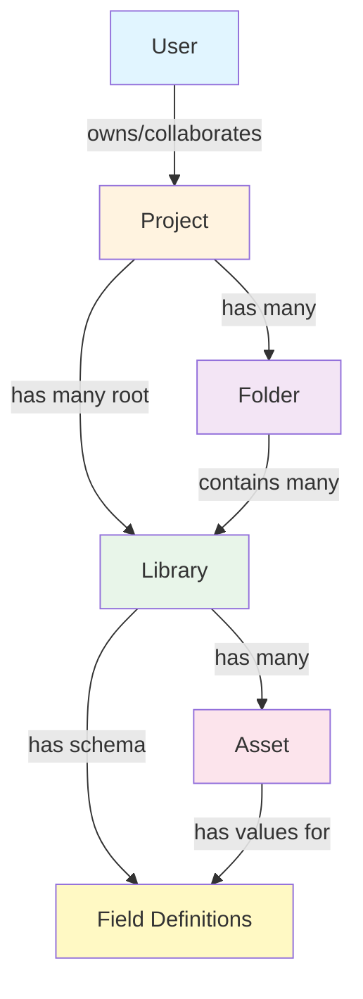

# Data Model: Cache Structures and Query Keys

**Feature**: Optimize Cache Invalidation Strategy  
**Date**: 2026-01-26  
**Phase**: 1 - Design

## Overview

This document defines the React Query cache data structures and query key conventions for the optimized cache invalidation strategy. It describes how entities are cached, their relationships, and the query keys used to access them.

## Entity Relationships



## Cache Data Structures

### 1. Project Entity

**Individual Project**:
```typescript
// Query Key: ['project', projectId]
interface ProjectCacheData {
  id: string;
  name: string;
  description: string | null;
  user_id: string;
  created_at: string;
  updated_at: string;
  // Computed/joined data
  updater?: {
    id: string;
    username: string | null;
    full_name: string | null;
    email: string;
  };
}
```

**Projects List**:
```typescript
// Query Key: ['projects']
interface ProjectsListCache {
  data: ProjectCacheData[];
}
```

**Usage**:
- Sidebar: Shows projects list
- TopBar: Shows current project name
- ProjectPage: Displays project details

**Cache Updates**:
- On project name edit: Update `['project', projectId]` and all `['projects']` lists
- On project created: Append to `['projects']`
- On project deleted: Remove from `['projects']`, invalidate `['project', projectId]`

---

### 2. Folder Entity

**Individual Folder**:
```typescript
// Query Key: ['folder', folderId]
interface FolderCacheData {
  id: string;
  name: string;
  project_id: string;
  created_at: string;
  updated_at: string;
  updater?: {
    id: string;
    username: string | null;
    full_name: string | null;
    email: string;
  };
}
```

**Folders List (by project)**:
```typescript
// Query Key: ['project', projectId, 'folders']
interface FoldersListCache {
  data: FolderCacheData[];
}
```

**Usage**:
- Sidebar: Shows folders in tree
- ProjectPage: Shows folder cards/list
- FolderPage: Displays folder details

**Cache Updates**:
- On folder name edit: Update `['folder', folderId]` and `['project', projectId, 'folders']`
- On folder created: Append to `['project', projectId, 'folders']`
- On folder deleted: Remove from lists, invalidate `['folder', folderId]`

---

### 3. Library Entity

**Individual Library**:
```typescript
// Query Key: ['library', libraryId]
interface LibraryCacheData {
  id: string;
  name: string;
  description: string | null;
  project_id: string;
  folder_id: string | null;  // null = root library
  created_at: string;
  updated_at: string;
  last_data_updated_at: string | null;
  updater?: {
    id: string;
    username: string | null;
    full_name: string | null;
    email: string;
  };
  data_updater?: {
    id: string;
    username: string | null;
    full_name: string | null;
    email: string;
  };
}
```

**Libraries Lists** (multiple scopes):
```typescript
// Query Key: ['project', projectId, 'libraries']
// Root libraries (folder_id = null) in project
interface RootLibrariesCache {
  data: LibraryCacheData[];
}

// Query Key: ['folder', folderId, 'libraries']
// Libraries in specific folder
interface FolderLibrariesCache {
  data: LibraryCacheData[];
}
```

**Library Summary** (metadata):
```typescript
// Query Key: ['library', libraryId, 'summary']
interface LibrarySummaryCache {
  id: string;
  name: string;
  description: string | null;
  assetCount: number;
  lastUpdated: string;
}
```

**Library Schema** (field definitions):
```typescript
// Query Key: ['library', libraryId, 'schema']
interface LibrarySchemaCache {
  sections: {
    id: string;
    name: string;
    order: number;
  }[];
  properties: {
    id: string;
    section_id: string;
    label: string;
    data_type: 'string' | 'int' | 'float' | 'boolean' | 'enum' | 'date';
    enum_options: string[] | null;
    required: boolean;
    order_index: number;
  }[];
}
```

**Usage**:
- Sidebar: Shows libraries in tree
- ProjectPage: Shows library cards/list (root libraries)
- FolderPage: Shows libraries in folder
- LibraryPage: Shows library details and schema

**Cache Updates**:
- On library name edit: Update `['library', libraryId]`, update in parent lists
- On library created: Append to appropriate list (root or folder)
- On library deleted: Remove from all lists, invalidate individual cache
- On schema changed: Invalidate `['library', libraryId, 'schema']`

---

### 4. Asset Entity

**Individual Asset**:
```typescript
// Query Key: ['asset', assetId]
interface AssetCacheData {
  id: string;
  name: string;
  library_id: string;
  created_at: string;
  updated_at: string;
}
```

**Assets List** (with properties):
```typescript
// Query Key: ['library', libraryId, 'assets']
interface AssetsListCache {
  data: {
    id: string;
    name: string;
    library_id: string;
    created_at: string;
    updated_at: string;
    properties: Record<string, any>;  // propertyId -> value
  }[];
}
```

**Usage**:
- Sidebar: Shows assets under library (name only)
- LibraryPage: Shows asset table with all properties
- AssetPage: Shows individual asset details (if implemented)

**Cache Updates**:
- On asset name edit: Update `['asset', assetId]` and in `['library', libraryId, 'assets']`
- On asset property edit: Update specific asset in `['library', libraryId, 'assets']`
- On asset created: Append to `['library', libraryId, 'assets']`
- On asset deleted: Remove from list, invalidate `['asset', assetId]`

---

## Query Key Conventions

### Standard Format

All query keys follow these patterns:

```typescript
// Individual entities (flat keys)
['project', projectId]
['folder', folderId]
['library', libraryId]
['asset', assetId]

// Entity lists (hierarchical keys)
['projects']                              // All user's projects
['project', projectId, 'folders']         // Folders in project
['project', projectId, 'libraries']       // Root libraries in project
['folder', folderId, 'libraries']         // Libraries in folder
['library', libraryId, 'assets']          // Assets in library

// Entity metadata (hierarchical keys)
['library', libraryId, 'summary']         // Library stats
['library', libraryId, 'schema']          // Field definitions
```

### Key Design Principles

1. **Individual entities use flat keys**: `['entity', id]`
   - Simple and unambiguous
   - Easy to target with `setQueryData`

2. **Lists use hierarchical keys**: `['parent', parentId, 'children']`
   - Shows parent-child relationship
   - Supports partial matching with `setQueriesData`

3. **Metadata uses descriptive suffixes**: `['entity', id, 'metadata']`
   - Distinguishes from main entity data
   - Can be cached independently

4. **Consistent pluralization**: `'libraries'` not `'library_list'`
   - Matches REST conventions
   - Easy to remember

### Query Key Factory

Centralized in `/lib/utils/queryKeys.ts`:

```typescript
export const queryKeys = {
  // Projects
  projects: () => ['projects'] as const,
  project: (id: string) => ['project', id] as const,
  projectFolders: (projectId: string) => ['project', projectId, 'folders'] as const,
  projectLibraries: (projectId: string) => ['project', projectId, 'libraries'] as const,
  
  // Folders
  folder: (id: string) => ['folder', id] as const,
  folderLibraries: (folderId: string) => ['folder', folderId, 'libraries'] as const,
  
  // Libraries
  library: (id: string) => ['library', id] as const,
  libraryAssets: (libraryId: string) => ['library', libraryId, 'assets'] as const,
  librarySchema: (libraryId: string) => ['library', libraryId, 'schema'] as const,
  librarySummary: (libraryId: string) => ['library', libraryId, 'summary'] as const,
  
  // Assets
  asset: (id: string) => ['asset', id] as const,
};
```

**Benefits**:
- Type-safe query keys
- Single source of truth
- Easy refactoring (change in one place)
- Auto-completion in IDE

---

## Cache Update Patterns

### Pattern 1: Update Entity Name (Most Common)

**Scenario**: User edits project/library/folder/asset name

**Affected Caches**:
1. Individual entity: `['entity', id]`
2. All lists containing entity: `['parent', parentId, 'children']`

**Update Strategy**:
```typescript
// 1. Update individual entity cache
queryClient.setQueryData(['entity', id], (old) => ({
  ...old,
  name: newName
}));

// 2. Update in all lists
queryClient.setQueriesData(
  { queryKey: ['entity'] },  // Matches all entity lists
  (oldList: any[] | undefined) => {
    if (!oldList) return oldList;
    return oldList.map(item =>
      item.id === id ? { ...item, name: newName } : item
    );
  }
);
```

**Network Requests**: 1 (update only)  
**Cache Reads**: 0 (writes only)

---

### Pattern 2: Create Entity

**Scenario**: User creates new library/folder/asset

**Affected Caches**:
1. Parent's children list: `['parent', parentId, 'children']`

**Update Strategy**:
```typescript
// Append to parent's list
queryClient.setQueryData(
  ['parent', parentId, 'children'],
  (old: any[] | undefined) => [...(old || []), newEntity]
);
```

**Network Requests**: 1 (insert only)  
**Cache Reads**: 0

---

### Pattern 3: Delete Entity

**Scenario**: User deletes library/folder/asset

**Affected Caches**:
1. Individual entity: `['entity', id]` - should be removed
2. All lists containing entity: `['parent', parentId, 'children']`

**Update Strategy**:
```typescript
// 1. Remove from all lists
queryClient.setQueriesData(
  { queryKey: ['entity'] },
  (oldList: any[] | undefined) => {
    if (!oldList) return oldList;
    return oldList.filter(item => item.id !== id);
  }
);

// 2. Remove individual cache
queryClient.removeQueries({ queryKey: ['entity', id] });
```

**Network Requests**: 1 (delete only)  
**Cache Reads**: 0

---

### Pattern 4: Update Entity Description/Metadata

**Scenario**: User edits project description

**Affected Caches**:
1. Individual entity: `['entity', id]`

**Update Strategy**:
```typescript
// Update only the changed field
queryClient.setQueryData(['entity', id], (old) => ({
  ...old,
  description: newDescription
}));
```

**Network Requests**: 1 (update only)  
**Cache Reads**: 0

**Note**: Description doesn't appear in lists, so no need to update list caches

---

## Cache Invalidation Strategy

### When to use `setQueryData` (direct update):
✅ Entity name changes
✅ Entity description/metadata changes  
✅ Entity created (append to list)
✅ Entity deleted (remove from list)
✅ Simple field updates

### When to use `invalidateQueries` (refetch):
✅ Complex structural changes (schema modifications)
✅ Batch operations (bulk delete)
✅ After background sync
✅ When cache might be stale
✅ Permission changes

### When to use `removeQueries`:
✅ Entity deleted (remove individual cache)
✅ User navigates away (cleanup)
✅ Logout (clear all user data)

---

## Real-time Integration

### Supabase Real-time Subscriptions

LibraryPage uses Postgres subscriptions for collaborative editing:

```typescript
// Subscribe to asset changes
supabase
  .channel(`library-assets:${libraryId}`)
  .on('postgres_changes', {
    event: '*',
    schema: 'public',
    table: 'library_assets',
    filter: `library_id=eq.${libraryId}`
  }, (payload) => {
    // Update cache instead of full refetch
    handleAssetChange(payload);
  })
  .subscribe();
```

**Cache Integration**:
- Real-time handler should use same cache mutation patterns
- `INSERT` → append to `['library', libraryId, 'assets']`
- `UPDATE` → update specific asset in list
- `DELETE` → remove from list

**Conflict Resolution**:
- Real-time update wins (source of truth is server)
- Optimistic updates should be overridden by real-time events
- Use `cancelQueries` to prevent race conditions

---

## Memory Considerations

### Expected Cache Sizes

**Before Optimization**:
- `['projects']`: ~10 projects × 1KB = 10KB
- `['folders-libraries', projectId]`: ~50 combined items × 0.5KB = 25KB
- `['assets', libraryId]`: ~100 assets × 0.5KB = 50KB
- **Total for active project**: ~85KB

**After Optimization**:
- `['projects']`: ~10 projects × 1KB = 10KB (same)
- `['project', projectId]`: 1 project = 1KB (new)
- `['project', projectId, 'folders']`: ~10 folders × 0.5KB = 5KB (new)
- `['project', projectId, 'libraries']`: ~20 libraries × 0.5KB = 10KB (new)
- `['folder', folderId]`: 1 folder = 1KB × 10 = 10KB (new, if multiple folders open)
- `['folder', folderId, 'libraries']`: ~5 libraries × 0.5KB × 10 = 25KB (new)
- `['library', libraryId]`: 1 library = 1KB × 5 = 5KB (new, if multiple libraries open)
- `['library', libraryId, 'assets']`: ~100 assets × 0.5KB = 50KB (same)
- **Total for active project**: ~116KB

**Increase**: +31KB (~36% more)

**Mitigation**:
- React Query's `cacheTime` (default 5 minutes) garbage collects unused data
- Most users only have 1-2 folders/libraries open at once
- Memory increase is acceptable for performance gain

---

## Validation

### Before Rolling Out

1. **Baseline Measurements**:
   - Count network requests for common operations
   - Measure cache memory usage
   - Record UI update latency

2. **After Optimization**:
   - Verify 60-80% reduction in requests
   - Ensure cache memory within 50% of baseline
   - Confirm UI updates under 100ms

3. **Testing Scenarios**:
   - Edit entity names (all 4 types)
   - Create/delete entities
   - Navigate between projects/libraries
   - Multi-user collaboration
   - Real-time updates

### Success Criteria

✅ Edit project name: 1 request (was 3-4)  
✅ Edit library name: 1 request (was 2-3)  
✅ Create library: 1 request (was 3-4)  
✅ Delete asset: 1 request (was 2-3)  
✅ Cache memory: <150KB for active project (baseline 85KB)  
✅ UI update latency: <100ms (was 300-500ms)

---

## References

- [React Query Cache Management](https://tanstack.com/query/latest/docs/framework/react/guides/caching)
- [Query Keys Best Practices](https://tkdodo.eu/blog/effective-react-query-keys)
- [Supabase Real-time](https://supabase.com/docs/guides/realtime)

