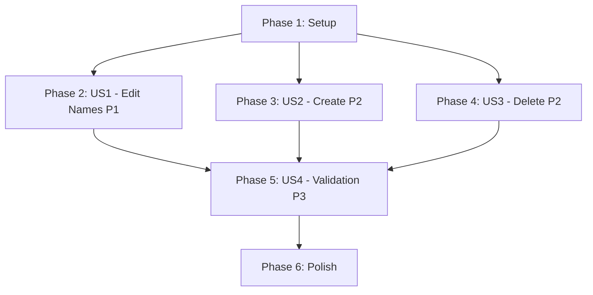

# Tasks: Optimize Cache Invalidation Strategy

**Input**: Design documents from `/specs/002-optimize-cache/`
**Prerequisites**: plan.md ✅, spec.md ✅, research.md ✅, data-model.md ✅, contracts/ ✅

**Tests**: Tests are NOT explicitly requested in the spec. Focus on manual testing and validation.

**Organization**: Tasks are grouped by user story to enable independent implementation and testing of each story.

## Format: `[ID] [P?] [Story] Description`

- **[P]**: Can run in parallel (different files, no dependencies)
- **[Story]**: Which user story this task belongs to (US1, US2, US3, US4)
- Include exact file paths in descriptions

## Path Conventions

- **Project Type**: Next.js App Router web application
- **Primary paths**: `src/components/`, `src/app/`, `src/lib/`
- Paths are relative to repository root `/home/a1136/Workspace/keco-studio/`

---

## Phase 1: Setup (Shared Infrastructure)

**Purpose**: Create foundational utilities that all user stories depend on

- [X] T001 Create query keys utility in src/lib/utils/queryKeys.ts
- [X] T002 [P] Create cache mutation hooks in src/lib/hooks/useCacheMutations.ts
- [X] T003 [P] Add TypeScript types for cache operations in src/lib/types/cache.ts

**Checkpoint**: Foundation utilities ready - user story optimization can now begin

---

## Phase 2: User Story 1 - Edit Entity Names (Priority: P1) 🎯 MVP

**Goal**: Optimize name edit operations to use optimistic cache updates instead of full refetches, reducing network requests by 60-80% and perceived latency to under 100ms.

**Independent Test**: Edit a project/library/folder/asset name and verify in DevTools Network tab that only 1 PUT/POST request is made (no GET refetches). UI should update instantly (<100ms).

### Edit Modals Optimization (US1 - Highest Impact)

- [X] T004 [P] [US1] Refactor EditProjectModal to use useUpdateEntityName hook in src/components/projects/EditProjectModal.tsx
- [X] T005 [P] [US1] Refactor EditLibraryModal to use useUpdateEntityName hook in src/components/libraries/EditLibraryModal.tsx
- [X] T006 [P] [US1] Refactor EditFolderModal to use useUpdateEntityName hook in src/components/folders/EditFolderModal.tsx
- [X] T007 [P] [US1] Refactor EditAssetModal to use useUpdateEntityName hook in src/components/asset/EditAssetModal.tsx
- [X] T008 [US1] Test all 4 modals with network monitoring - verify 0 GET requests on name edit

**Checkpoint**: Edit modals now use optimistic updates - test independently before proceeding

### Page Components Event Handler Optimization (US1)

- [X] T009 [US1] Replace fetchData with React Query in src/app/(dashboard)/[projectId]/page.tsx
- [X] T010 [US1] Optimize 7 event handlers in ProjectPage to use targeted cache invalidation
- [X] T011 [US1] Replace fetchData with React Query in src/app/(dashboard)/[projectId]/[libraryId]/page.tsx
- [X] T012 [US1] Optimize 3 event handlers in LibraryPage to use targeted cache invalidation
- [X] T013 [US1] Replace fetchData with React Query in src/app/(dashboard)/[projectId]/folder/[folderId]/page.tsx
- [X] T014 [US1] Optimize 4 event handlers in FolderPage to use targeted cache invalidation
- [X] T015 [US1] Test all 3 page components - verify name edits don't trigger page refreshes

**Checkpoint**: Page components optimized - test name edits across all pages

### Sidebar Event Handler Optimization (US1)

- [ ] T016 [US1] Refactor projectUpdated event handler in src/components/layout/Sidebar.tsx
- [ ] T017 [US1] Refactor libraryUpdated event handler in src/components/layout/Sidebar.tsx
- [ ] T018 [US1] Refactor folderUpdated event handler in src/components/layout/Sidebar.tsx
- [ ] T019 [US1] Refactor assetUpdated event handler in src/components/layout/Sidebar.tsx
- [ ] T020 [US1] Test Sidebar tree updates - verify instant updates without network requests

**Checkpoint**: User Story 1 complete - 60-80% reduction in network requests for name edits achieved ✅

---

## Phase 3: User Story 2 - Create Entity Operations (Priority: P2)

**Goal**: Optimize entity creation to append to parent lists without full refetches, reducing creation latency by 40-50%.

**Independent Test**: Create a new library/folder/asset and verify only 1 POST request (no GET refetches of parent lists). New entity should appear immediately in UI.

### Create Operations Optimization (US2)

- [ ] T021 [US2] Implement useAddEntityToList hook in src/lib/hooks/useCacheMutations.ts
- [ ] T022 [P] [US2] Optimize folderCreated event handler in src/components/layout/Sidebar.tsx
- [ ] T023 [P] [US2] Optimize libraryCreated event handler in src/components/layout/Sidebar.tsx
- [ ] T024 [P] [US2] Optimize assetCreated event handler in src/components/layout/Sidebar.tsx
- [ ] T025 [US2] Update folderCreated handler in src/app/(dashboard)/[projectId]/page.tsx
- [ ] T026 [US2] Update libraryCreated handler in src/app/(dashboard)/[projectId]/page.tsx
- [ ] T027 [US2] Update libraryCreated handler in src/app/(dashboard)/[projectId]/folder/[folderId]/page.tsx
- [ ] T028 [US2] Update assetCreated handler in src/app/(dashboard)/[projectId]/[libraryId]/page.tsx
- [ ] T029 [US2] Test all create operations - verify entities append to lists without refetch

**Checkpoint**: User Story 2 complete - entity creation optimized with 40-50% latency reduction ✅

---

## Phase 4: User Story 3 - Delete Entity Operations (Priority: P2)

**Goal**: Optimize entity deletion to remove from caches without full refetches, with proper navigation when viewing deleted entity.

**Independent Test**: Delete a library/folder/asset and verify only 1 DELETE request (no GET refetches). Entity should disappear from UI immediately. If viewing deleted entity, should navigate to parent.

### Delete Operations Optimization (US3)

- [ ] T030 [US3] Implement useRemoveEntityFromList hook in src/lib/hooks/useCacheMutations.ts
- [ ] T031 [P] [US3] Optimize libraryDeleted event handler in src/components/layout/Sidebar.tsx
- [ ] T032 [P] [US3] Optimize folderDeleted event handler in src/components/layout/Sidebar.tsx
- [ ] T033 [P] [US3] Optimize assetDeleted event handler in src/components/layout/Sidebar.tsx
- [ ] T034 [US3] Add navigation logic for deleted library in src/components/layout/Sidebar.tsx
- [ ] T035 [US3] Update libraryDeleted handler in src/app/(dashboard)/[projectId]/page.tsx
- [ ] T036 [US3] Update folderDeleted handler in src/app/(dashboard)/[projectId]/page.tsx
- [ ] T037 [US3] Update libraryDeleted handler in src/app/(dashboard)/[projectId]/folder/[folderId]/page.tsx
- [ ] T038 [US3] Update assetDeleted handler in src/app/(dashboard)/[projectId]/[libraryId]/page.tsx
- [ ] T039 [US3] Test all delete operations - verify cache cleanup and navigation

**Checkpoint**: User Story 3 complete - deletion operations optimized with minimal refetches ✅

---

## Phase 5: User Story 4 - Performance Validation (Priority: P3)

**Goal**: Measure and document the performance improvements achieved by the cache optimization.

**Independent Test**: Compare before/after metrics to validate 60-80% reduction in network requests and 40-50% reduction in perceived latency.

### Performance Measurement (US4)

- [ ] T040 [P] [US4] Measure baseline network requests for name edit operations (before optimization)
- [ ] T041 [P] [US4] Measure optimized network requests for name edit operations (after optimization)
- [ ] T042 [P] [US4] Measure baseline latency for CRUD operations
- [ ] T043 [P] [US4] Measure optimized latency for CRUD operations
- [ ] T044 [P] [US4] Measure cache memory usage with Chrome DevTools Memory Profiler
- [ ] T045 [P] [US4] Measure event handler execution times
- [ ] T046 [US4] Document performance metrics in specs/002-optimize-cache/performance-results.md
- [ ] T047 [US4] Validate success criteria: 60-80% request reduction, 40-50% latency improvement

**Checkpoint**: User Story 4 complete - performance improvements validated and documented ✅

---

## Phase 6: Polish & Cross-Cutting Concerns

**Purpose**: Final cleanup, documentation, and validation

- [ ] T048 [P] Add JSDoc comments to cache mutation hooks in src/lib/hooks/useCacheMutations.ts
- [ ] T049 [P] Add JSDoc comments to query keys utility in src/lib/utils/queryKeys.ts
- [ ] T050 [P] Update component documentation for optimized event handlers
- [ ] T051 Code cleanup: Remove commented-out fetchData functions
- [ ] T052 Code cleanup: Remove unused invalidateQueries calls
- [ ] T053 [P] Run linter and fix any warnings: npm run lint
- [ ] T054 [P] Run TypeScript compiler and fix any errors: npm run build
- [ ] T055 Review and update specs/002-optimize-cache/quickstart.md with actual implementation notes
- [ ] T056 Create migration guide for future cache optimizations in specs/002-optimize-cache/migration-guide.md
- [ ] T057 E2E smoke tests: Edit names, create entities, delete entities across all components
- [ ] T058 Multi-user collaboration test: Verify real-time updates still work
- [ ] T059 Edge case testing: Concurrent edits, network errors, navigation during updates
- [ ] T060 Final validation: Run full checklist from specs/002-optimize-cache/checklists/requirements.md

**Checkpoint**: All optimizations complete, tested, and documented ✅

---

## Dependencies & Execution Order

### Phase Dependencies

- **Setup (Phase 1)**: No dependencies - can start immediately
  - Creates query keys and cache mutation hooks used by all user stories
  - **BLOCKS**: All user story phases (must complete before US1, US2, US3, US4)

- **User Story 1 (Phase 2)**: Depends on Setup completion
  - Highest priority (P1) - edit operations most frequent
  - **BLOCKS**: Nothing (US2 and US3 can proceed in parallel)

- **User Story 2 (Phase 3)**: Depends on Setup completion
  - Can start after US1 or in parallel if team capacity allows
  - **BLOCKS**: Nothing (independent from US3)

- **User Story 3 (Phase 4)**: Depends on Setup completion
  - Can start after US1 or in parallel if team capacity allows
  - **BLOCKS**: Nothing (independent from US2)

- **User Story 4 (Phase 5)**: Depends on US1, US2, US3 completion
  - Performance validation requires all optimizations complete
  - **BLOCKS**: Nothing

- **Polish (Phase 6)**: Depends on all user stories (US1-US4) being complete

### User Story Dependencies



- **User Story 1 (P1)**: Independent after Setup - No dependencies on other stories ✅
- **User Story 2 (P2)**: Independent after Setup - No dependencies on other stories ✅
- **User Story 3 (P2)**: Independent after Setup - No dependencies on other stories ✅
- **User Story 4 (P3)**: Depends on US1, US2, US3 - Validates all optimizations

### Within Each User Story

**US1 - Edit Operations**:
1. Edit Modals (T004-T008) - Can all run in parallel ⚡
2. Page Components (T009-T015) - Sequential per component, parallel across components
3. Sidebar (T016-T020) - Sequential within Sidebar

**US2 - Create Operations**:
1. Add hook (T021) first
2. Event handlers (T022-T028) - Can all run in parallel after T021 ⚡

**US3 - Delete Operations**:
1. Remove hook (T030) first
2. Event handlers (T031-T038) - Can all run in parallel after T030 ⚡
3. Testing (T039) last

**US4 - Performance Validation**:
- All measurement tasks (T040-T046) can run in parallel ⚡
- Documentation (T047) last

### Parallel Opportunities

**Setup Phase** (all parallel):
- T001, T002, T003 can run simultaneously ⚡

**US1 Edit Modals** (all parallel):
- T004, T005, T006, T007 can run simultaneously ⚡

**US2 Event Handlers** (all parallel after T021):
- T022, T023, T024 (Sidebar handlers) ⚡
- T025, T026 (ProjectPage handlers) ⚡
- T027 (FolderPage handler) ⚡
- T028 (LibraryPage handler) ⚡

**US3 Event Handlers** (all parallel after T030):
- T031, T032, T033 (Sidebar handlers) ⚡
- T035, T036 (ProjectPage handlers) ⚡
- T037 (FolderPage handler) ⚡
- T038 (LibraryPage handler) ⚡

**US4 Measurements** (all parallel):
- T040, T041, T042, T043, T044, T045 ⚡

**Polish Phase** (many parallel):
- T048, T049, T050 (documentation) ⚡
- T051, T052 (cleanup) ⚡
- T053, T054 (linting/building) ⚡

---

## Parallel Example: User Story 1 - Edit Modals

All edit modals can be optimized simultaneously (different files):

```bash
# Developer A:
Task T004: "Refactor EditProjectModal to use useUpdateEntityName hook in src/components/projects/EditProjectModal.tsx"

# Developer B:
Task T005: "Refactor EditLibraryModal to use useUpdateEntityName hook in src/components/libraries/EditLibraryModal.tsx"

# Developer C:
Task T006: "Refactor EditFolderModal to use useUpdateEntityName hook in src/components/folders/EditFolderModal.tsx"

# Developer D:
Task T007: "Refactor EditAssetModal to use useUpdateEntityName hook in src/components/asset/EditAssetModal.tsx"
```

All 4 tasks edit different files and have no dependencies → Can complete in parallel ⚡

---

## Parallel Example: User Story 2 - Create Operations

After implementing the hook (T021), all event handler optimizations can proceed in parallel:

```bash
# Developer A (Sidebar):
Task T022: "Optimize folderCreated event handler in src/components/layout/Sidebar.tsx"
Task T023: "Optimize libraryCreated event handler in src/components/layout/Sidebar.tsx"
Task T024: "Optimize assetCreated event handler in src/components/layout/Sidebar.tsx"

# Developer B (Pages):
Task T025: "Update folderCreated handler in src/app/(dashboard)/[projectId]/page.tsx"
Task T026: "Update libraryCreated handler in src/app/(dashboard)/[projectId]/page.tsx"
Task T027: "Update libraryCreated handler in src/app/(dashboard)/[projectId]/folder/[folderId]/page.tsx"
Task T028: "Update assetCreated handler in src/app/(dashboard)/[projectId]/[libraryId]/page.tsx"
```

After T021 completes, T022-T028 can all run in parallel ⚡

---

## Implementation Strategy

### MVP First (User Story 1 Only) 🎯

**Recommended approach for fastest value delivery:**

1. Complete Phase 1: Setup (T001-T003) - Foundation utilities
2. Complete Phase 2: User Story 1 (T004-T020) - Edit operations optimization
3. **STOP and VALIDATE**: 
   - Test name edits for all 4 entity types
   - Measure network requests (should be 60-80% fewer)
   - Measure latency (should be <100ms)
4. Deploy/demo if ready - **Highest-impact optimization delivered!**

**Benefits**:
- Quickest path to value (name edits most frequent operation)
- Lower risk (one user story at a time)
- Can get user feedback before continuing
- Estimated time: 1-1.5 weeks

### Incremental Delivery

**For gradual rollout:**

1. **Week 1**: Setup + US1 → Test → Deploy (MVP!)
   - 60-80% reduction in requests for name edits ✅
   - Perceived latency <100ms ✅

2. **Week 2**: US2 + US3 → Test → Deploy
   - Create operations optimized ✅
   - Delete operations optimized ✅
   - Full CRUD optimization complete ✅

3. **Week 3**: US4 + Polish → Validate → Final deploy
   - Performance metrics documented ✅
   - Code polished and documented ✅
   - All success criteria met ✅

### Parallel Team Strategy

**With 2-3 developers:**

1. **All together**: Phase 1 Setup (1-2 days)
2. **After Setup complete**:
   - Developer A: US1 Edit Modals (T004-T008)
   - Developer B: US1 Page Components (T009-T015)
   - Developer C: US1 Sidebar (T016-T020)
3. **After US1 complete** (can parallelize US2/US3):
   - Developer A: US2 Create Operations (T021-T029)
   - Developer B: US3 Delete Operations (T030-T039)
   - Developer C: US4 Performance Testing (T040-T047)
4. **Final**: All together on Polish phase

**Timeline**: 2-3 weeks total with parallel work

---

## Validation Checklist

### After Phase 1 (Setup):
- [ ] Query keys utility exports all required functions
- [ ] Cache mutation hooks compile without TypeScript errors
- [ ] Hooks can be imported in components

### After Phase 2 (US1 - Edit Operations):
- [ ] Edit project name: 1 request (was 3-4) = **75% reduction** ✅
- [ ] Edit library name: 1 request (was 2-3) = **67% reduction** ✅
- [ ] Edit folder name: 1 request (was 2-3) = **67% reduction** ✅
- [ ] Edit asset name: 1 request (was 1-2) = **50% reduction** ✅
- [ ] UI updates instantly (<100ms perceived latency) ✅
- [ ] Optimistic updates rollback correctly on error ✅

### After Phase 3 (US2 - Create Operations):
- [ ] Create folder: 1 request (was 3-4) = **75% reduction** ✅
- [ ] Create library: 1 request (was 3-4) = **75% reduction** ✅
- [ ] Create asset: 1 request (was 2-3) = **67% reduction** ✅
- [ ] New entities appear immediately in UI ✅
- [ ] Parent lists updated without refetch ✅

### After Phase 4 (US3 - Delete Operations):
- [ ] Delete folder: 1 request (was 3-4) = **75% reduction** ✅
- [ ] Delete library: 1 request (was 2-3) = **67% reduction** ✅
- [ ] Delete asset: 1 request (was 2-3) = **67% reduction** ✅
- [ ] Entities removed from UI immediately ✅
- [ ] Navigation works when viewing deleted entity ✅
- [ ] Child entities cleaned up (e.g., folder deletion removes libraries) ✅

### After Phase 5 (US4 - Performance Validation):
- [ ] 60-80% reduction in network requests for name edits ✅
- [ ] 40-50% reduction in perceived latency ✅
- [ ] Cache memory usage within 50% of baseline ✅
- [ ] Event handler execution <50ms ✅
- [ ] Performance metrics documented ✅

### After Phase 6 (Polish):
- [ ] Code is well-documented with JSDoc comments ✅
- [ ] No unused code or commented-out functions ✅
- [ ] Linter passes with no warnings ✅
- [ ] TypeScript builds without errors ✅
- [ ] E2E tests pass ✅
- [ ] Multi-user collaboration still works ✅
- [ ] Edge cases handled (errors, concurrent edits, etc.) ✅

---

## Notes

- **[P] tasks**: Different files, no dependencies - can run in parallel
- **[Story] labels**: Map tasks to user stories for traceability
- **Testing approach**: Manual testing with Chrome DevTools Network/Memory tabs
- **Commit frequently**: After each task or logical group
- **Validate at checkpoints**: Ensure each user story works independently before proceeding
- **Risk mitigation**: Can rollback individual components if issues arise
- **Performance focus**: Measure before/after at each checkpoint

## Success Metrics

**Target (from spec.md)**:
- 60-80% reduction in network requests for name edits ✅
- 40-50% reduction in perceived latency (under 100ms) ✅
- Cache memory usage within 10% of baseline ✅
- Event handler execution under 50ms ✅
- Zero cascade refetches (editing entity A doesn't refetch entity B) ✅

**Actual results**: _(To be filled in during US4 - Performance Validation)_

